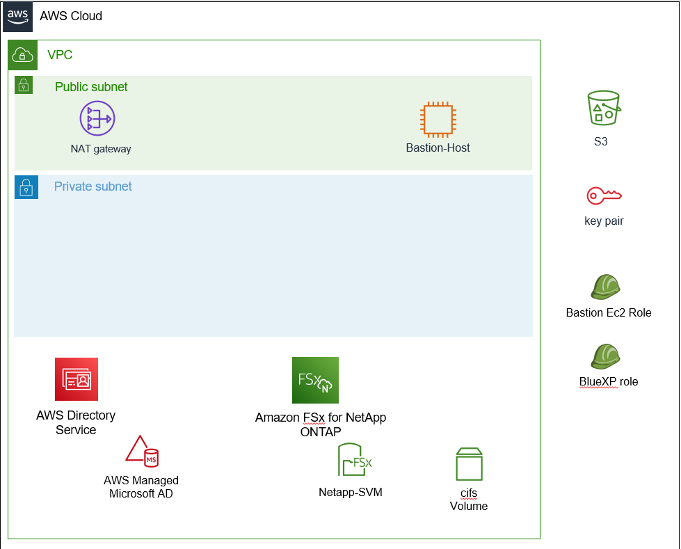

# BlueXP Hands on
BlueXP Hands on 환경 빠른 배포를 위한 구성

## Architecture


- MSAD : <prefix>.com으로 생성됩니다.
- FSxN : <prefix>-fsxn 으로 생성됩니다.
- Key pair : <prefix>_key로 생성됩니다. CVO, Bastion server등에서 사용됩니다.
- s3 : CDK parameter를 참조하기위한 s3입니다.

## requierment
- aws cdk 환경이 구성되어 있어야 합니다.
- aws cli가 설치되어 있어야 합니다.( 확인용 )

## How to use
1. download ZIP file or use git clone
```powershell
> git clone https://github.com/netappkr/netappkr_AWSCDK.git
```
2. cdk bootstrap 
```
> pwd
netappkr_AWSCDK\BlueXP_CDK
> cdk bootstrap --profile <AWS CLI 구성중 설정할 수 있는 .aws/config 파일에 명시된 profile 이름 >
```
> ### Tips
> #### aws profile 구성 확인 명령
> ```powershell 
> aws configure list-profiles
> ```

3. cdk synth
4. cdk diff

### Main Stack
```Main Stack```이 생성 되고 각 ```NestedStack```을 배포합니다.
필요하지 않은 스택은 주석처리 하세요.

### 예시
```python
        # stack
        NW = NetworkStack(self, "NetworkStack", prefix=prefix)
        Tags.of(NW).add("creator", creator.value_as_string)

        BlueXP = BlueXPReqStack(self, "BlueXPReqStack", prefix=prefix)
        Tags.of(BlueXP).add("creator", creator.value_as_string)

        AD = ADStack(self, "ADStack", vpc=NW.vpc, prefix=prefix)
        Tags.of(AD).add("creator", creator.value_as_string)
        AD.add_dependency(NW)

        bastionhost = BastionStack(self, "BastionStack", vpc=NW.vpc, defaultsg=NW.defaultsg, prefix=prefix)
        Tags.of(bastionhost).add("creator", creator.value_as_string)
        bastionhost.add_dependency(NW)

        FSxN = FSxNStack(self, "FSxNStack", vpc=NW.vpc, AD=AD.cfn_microsoft_AD, defaultsg=NW.defaultsg, prefix=prefix)
        Tags.of(FSxN).add("creator", creator.value_as_string)
        FSxN.add_dependency(AD)
```
# 참조
https://docs.aws.amazon.com/cdk/api/v2/python/